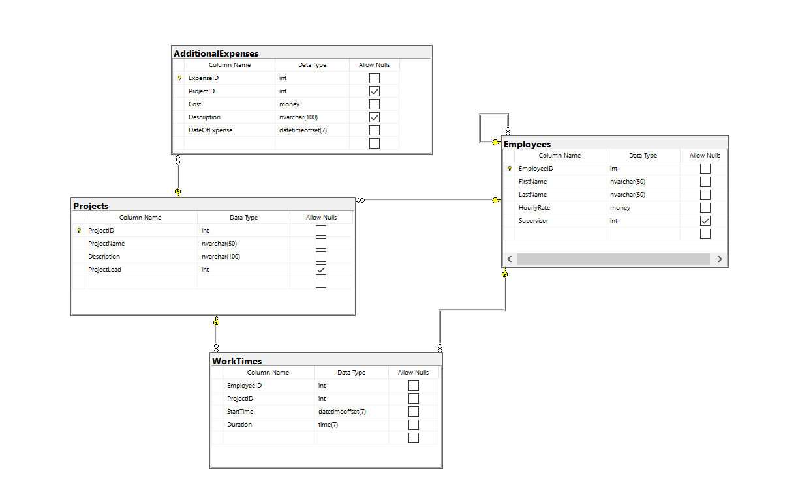

# Dokumentacja bazy danych Zarzadzanie_projektami

Pozwala na ewidencję czasu pracy pracowników, wyznaczanie należnego wynagrodzenia, sprawdzanie nad jakimi projektami pracują oraz monitorowanie kosztów projektów.

### Tabele. Diagram
Ta baza danych zawiera 4 tabele. Ich relacje przedstawione są na wykresie


### Tabele. Opis
 - `Employees`: Tabela zawiera dane pracowników takie jak ID pracownika, imię i nazwisko, oraz stawka godzinowa, oraz kto jest czyim przełożonym.

```{sql}
create table Employees (
	EmployeeID int not null primary key,
	FirstName nvarchar(50) not null,
	LastName nvarchar(50) not null,
	HourlyRate money not null,
	Supervisor int
	constraint FK_Employees_Employees
		foreign key (Supervisor)
		references Employees(EmployeeID)
);
```

 - `Projects`: Zawiera informację na temat projektów. ID projektu, nazwę projektu, opis projektu, na który składa sie informacja o kliencie oraz miasta, w których zlecenie ma być wykonane, oraz informacje o tym kto jest liderem projektu.
 
 ```{sql}
create table Projects (
	ProjectID int not null primary key,
	ProjectName nvarchar(50) not null,
	Description nvarchar(100) not null,
	ProjectLead int,
	constraint FK_Projects_Employees
		foreign key (ProjectLead)
		references Employees(EmployeeID)
		on update cascade
		on delete set null
);
 ```
 
 - `AdditionalExpenses`: Zawiera informacje o kosztach związanych z projektami, które nie wynikają potrzeby płacenia pracownikom (nie wliczając pensji). Każdy rekord zawiera ID wydatku, ID projektu z jakim wydatek jest związany, jego koszt, oraz krótki opis wydatku.
 
 ```{sql}
create table AdditionalExpenses (
	ExpenseID int not null primary key,
	ProjectID int,
	Cost money not null,
	Description nvarchar(100),
	DateOfExpense datetimeoffset(7) not null,
	constraint FK_AdditionalExpenses_Projects
		foreign key (ProjectID)
		references Projects(ProjectID)
		on update cascade
		on delete cascade
);
 ```
 
 - `WorkTimes`: Zawiera rekordy informujące o zalogowaniu pracownika do systemu odmierzającego przepracowany czas, czas jaki spędził w pracy, oraz nad jakim projektem pracował.
 
 ```{sql}
create table WorkTimes (
	EmployeeID int not null,
	ProjectID int not null,
	StartTime datetimeoffset(7) not null,
	Duration time(7) not null,
	constraint FK_WorkTimes_Projects foreign key (ProjectID) references Projects(ProjectID),
	constraint FK_WorkTimes_Employees foreign key (EmployeeID) references Employees(EmployeeID)
);
 ```


